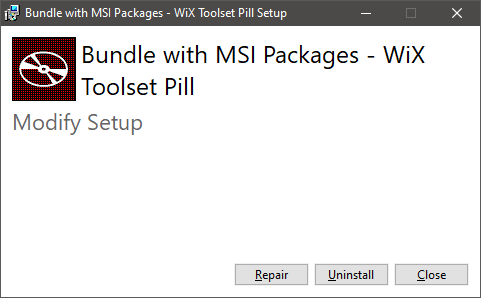

# Bundle with MSI

**Note**: A full example can be found in the `sources` directory from the current repo.

## Prerequisites

WiX Toolset must be previously installed (not described in this tutorial)

## Two MSI Projects

First of all, we need to create two dummy MSI projects. These will be, later, included in the bundle. Each installer will deploy a single text file.

The focus of the current pill is the bundle itself. Therefore, for more details about creating the dummy installers:

-  check out the example in the `sources` directory or, for even more details,
- check out the "My First Installer" tutorial here: https://github.com/WiX-Toolset-Pills-15mg/My-First-Installer

**Note**: The two MSI files created by these projects are two normal installers that can also be installed independently.

Further, we will see how they can be integrated in a bundle.

## The Bundle

A bundle, unlike the MSI is an executable file created by WiX Toolset that contains and installs a number of packages (MSI or EXE). In this tutorial we will see how to include MSI packages into the bundle.

### Step 1 - The bundle project

Add a new "Bootstrapper Project for WiX v3" project:


### Step 2 - Choose the bootstrapper application

The bootstrapper application is the one that runs the whole bundle. It may also provide a GUI.

WiX Toolset provides a few bootstrapper applications that can be used out of the box. For this tutorial, we will use the `WixStandardBootstrapperApplication.RtfLicense` that displays a default GUI with a single page containing a dummy license agreement.

```xml
<Wix xmlns="http://schemas.microsoft.com/wix/2006/wi">
    <Bundle ...>
        
        <BootstrapperApplicationRef Id="WixStandardBootstrapperApplication.RtfLicense" />
        
        ...
        
    </Bundle>
</Wix>
```

### Step 3 - Reference the MSI projects

In this tutorial, we have two WiX projects `Installer1` and `Installer2` that builds the two MSI files.

Right-click on the bundle project -> Add -> Reference and add them to the bundle.

**Note**: If the MSI files are created by a third party or by a project from another solution, there is no need to do anything here. Just make sure you know the path to the MSI files. Usually we copy all the external MSI files in a directory inside the solution directory, to always use paths relative to the solution's root directory.

**Note**: If the name of a referenced installer projects is changed, the reference must be deleted and remade.

### Step 4 - Add the MSIs to the Chain

If the two MSI files are generated by projects from the current solution that are referenced by the bundle, as it is the situation in our tutorial, we can use the variables `TargetDir` and `TargetName` to obtain the actual path to the build-time generated MSI files.

```xml
<Wix xmlns="http://schemas.microsoft.com/wix/2006/wi">
    <Bundle ...>
        
        ...
        
        <Chain>
            <MsiPackage SourceFile="$(var.Installer1.TargetDir)$(var.Installer1.TargetName).msi" />
            <MsiPackage SourceFile="$(var.Installer2.TargetDir)$(var.Installer2.TargetName).msi" />
        </Chain>

    </Bundle>
```

The `Installer1` and `Installer2` sections from the variable names are exactly the names of the MSI projects referenced by the bundle. If the name of the project changes, this variable names must be updated.

If the MSI files already exists, the full or relative path must be specified instead.

The bundle will install them in the order in which they are added to the `Chain` element.

### Step 5 - Build and run the bundle

#### Install

When executed, the bundle will display the following GUI:


Each MSI installer is installed in its own directory just as it would be installed if executed individually.


In "Programs and Features" only the bundle is displayed. No record for the individual MSI installers is added.


#### Uninstall

If the installer is executed again, the bundle automatically detects that it is already installed and offers the repair and uninstall options:

